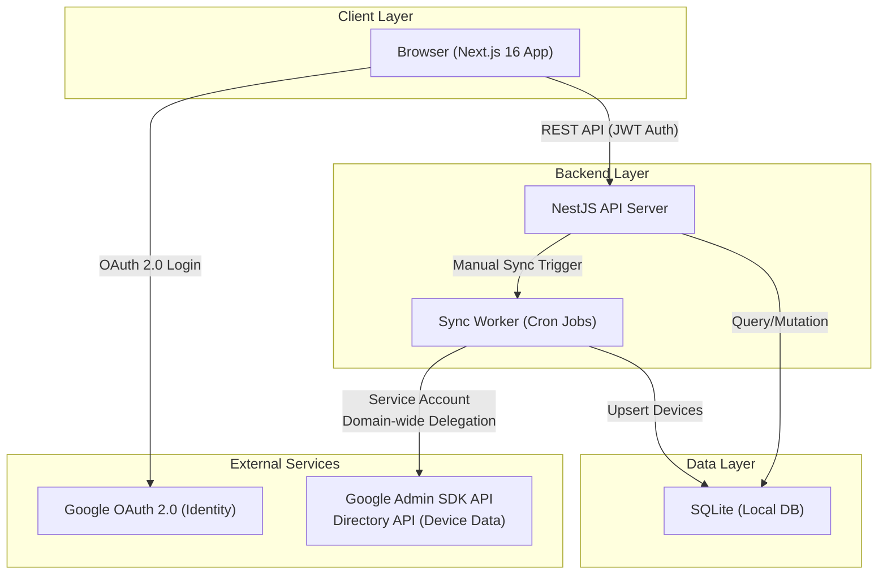

# IT Asset & Security Management System (Chrome OS Flex)

당근서비스 워크 플랫폼 내에서 Chrome OS Flex 디바이스의 IT 자산 관리와 보안 모니터링을 통합적으로 수행하기 위한 시스템입니다. Google Admin Console과 연동하여 분산된 디바이스 데이터를 통합하고, 실시간으로 사내 자산 번호(Asset Tag)와 매핑하여 자산 정합성을 확보합니다.

## 1. 전체 아키텍처

시스템은 확장성과 유지보수성을 고려하여 **Next.js(프론트엔드)**와 **NestJS(백엔드)**가 분리된 모던 웹 아키텍처를 채택하고 있습니다.



## 2. 기술 스택 (Tech Stack)

| Layer | 기술 스택 | 비고 |
| --- | --- | --- |
| **Frontend** | Next.js 16 (App Router), Tailwind CSS, Lucide React, Recharts | 고성능 대시보드 및 실시간 차트 |
| **Backend** | NestJS, TypeORM, Swagger | 모듈형 서버 프레임워크 |
| **Database** | SQLite 3 | 로컬 데이터 영속성 관리 (`backend/data/`) |
| **Sync Worker** | NestJS Task Scheduling | Google Admin API 정기 동기화 (node-cron) |

## 3. 핵심 기능 (Key Features)

- **통합 대시보드**: 전체 디바이스 수, 활성 상태, 자산 연결 완료율 등을 실시간으로 집계하여 시각화합니다.
- **디바이스 관리 (Chrome OS Flex)**: Google Admin API를 통해 수집된 상세 디바이스 제원(CPU, RAM, MAC Address 등)을 관리합니다.
- **자산 매핑 (Asset Mapping)**: 시리얼 번호를 기반으로 Google Admin의 디바이스 데이터와 사내 자산 번호(Asset Tag)를 1:1로 매칭합니다.
- **동기화 전략 (Sync Strategy)**:
    - **Full Sync**: 전체 디바이스 리스트를 페이지 단위로 순회하며 정합성을 검토합니다.
    - **Delta Sync**: `lastSync` 값이 이전 동기화 시점보다 큰 기기(변경분)만 쿼리하여 빠르게 반영합니다.

## 4. Google API 연동 및 인증

### 하이브리드 인증 모델

안전한 서버 간 통신과 사용자 인증을 위해 이중 인증 방식을 사용합니다.
- **OAuth 2.0**: 관리자 대시보드 접근 권한 확인 (`openid`, `email`, `profile`)
- **Service Account**: 백그라운드 디바이스 데이터 수집 (`admin.directory.device.chromeos.readonly`)

## 5. 로컬 개발 환경 설정

### 1. Backend Setup
```bash
cd backend
npm install
npm run dev
```
> 백엔드는 `http://localhost:4001`에서 실행됩니다. 데이터는 `backend/data/` 폴더에 SQLite 파일로 저장됩니다.

### 2. Frontend Setup
```bash
cd frontend
npm install
npm run dev
```
> 프론트엔드는 `http://localhost:3001`에서 실행됩니다. (Next.js Turbopack 활성화)

---
© 2026 IT Asset Management Team
