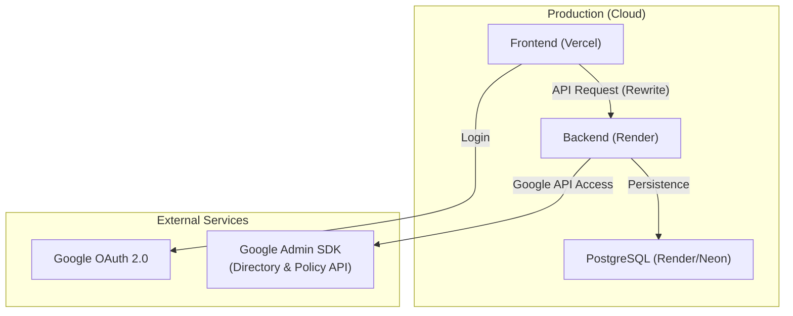

# IT Asset & Security Management System (Chrome OS Flex)

당근서비스 워크 플랫폼 내에서 Chrome OS Flex 디바이스의 IT 자산 관리와 보안 모니터링을 통합적으로 수행하기 위한 시스템입니다. Google Admin Console과 연동하여 분산된 디바이스 데이터를 통합하고, 실시간으로 사내 자산 번호(Asset Tag)와 매핑하여 자산 정합성을 확보합니다.

---

## 1. 전체 아키텍처 및 배포 환경

### 1.1 서비스 구조
본 시스템은 클라우드 네이티브 환경에 최적화되어 있으며, 프론트엔드와 백엔드가 분리되어 배포됩니다.



### 1.2 배포 스택 (Deployment)

| 구성 요소 | 플랫폼 | 주소 |
| --- | --- | --- |
| **Frontend** | Vercel | [it-asset-managementdaangnservice.vercel.app](https://it-asset-managementdaangnservice.vercel.app) |
| **Backend** | Render.com | [it-asset-management-etv4.onrender.com](https://it-asset-management-etv4.onrender.com) |
| **Database** | Render PostgreSQL | 내부 연동 |

---

## 2. Google API 연동 구조

### 2.1 통합 API 활용
기존 Directory APIに加え, Chrome Policy API를 통합하여 정책 관리 기능을 강화했습니다.

*   **Directory API**: 기기 목록, 시리얼 번호, OS 버전, 사용자 정보 조회
*   **Chrome Policy API**: 조직 단위(OU)별 브라우저 및 기기 정책(세이프 브라우징, 스크린샷 차단 등) 실시간 제어

### 2.2 인증 체계
*   **Service Account**: JSON 키를 환경 변수(`GOOGLE_SERVICE_ACCOUNT_KEY`)에 직접 주입하여 서버 간 인증 수행.
*   **Domain-wide Delegation**: 관리자 권한(`laika@daangnservice.com`)을 위임받아 조직 전체 데이터에 접근.

---

## 3. 데이터베이스 (Database)

시스템 환경에 따라 데이터베이스 엔진을 유연하게 전환합니다.

*   **Development (Local)**: `SQLite (sqljs)`를 사용하여 별도 서버 없이 간편하게 개발. (`chromeos_assets.sqlite`)
*   **Production (Cloud)**: `PostgreSQL`을 사용하여 안정적인 데이터 저장 및 고가용성 확보.

**동적 구성 로직:**
`DATABASE_URL` 환경 변수 존재 여부에 따라 TypeORM이 드라이버를 자동으로 선택합니다.

---

## 4. 환경 변수 설정 (Environment Variables)

배포 시 아래 변수들이 필수적으로 구성되어야 합니다.

### 4.1 Backend (Render)
*   `DB_TYPE`: `postgres`
*   `DATABASE_URL`: PostgreSQL 접속 URI
*   `GOOGLE_SERVICE_ACCOUNT_KEY`: 서비스 계정 JSON 전체 내용
*   `GOOGLE_DELEGATED_ADMIN`: 위임 관리자 이메일
*   `FRONTEND_URL`: Vercel 앱 주소 (CORS 허용용)

### 4.2 Frontend (Vercel)
*   `NEXT_PUBLIC_BACKEND_URL`: Render 백엔드 주소 (Rewrites 설정용)

---

## 5. 프로젝트 구조 (Project Structure)

```text
it-asset-management/
├── frontend/                    # Next.js 14 App Router (Vercel)
│   ├── src/app/                 # 정책 관리 및 대시보드 UI
│   └── next.config.mjs          # 백엔드 프록시(Rewrites) 설정
├── backend/                     # NestJS (Render)
│   ├── src/sync/                # Google Admin/Policy API 연동 로직
│   ├── src/policies/            # 정책 관리 API
│   └── src/app.module.ts        # 동적 DB 구성 로직
└── README.md                    # 기술 사양서
```

---
© 2026 IT Asset Management Team
