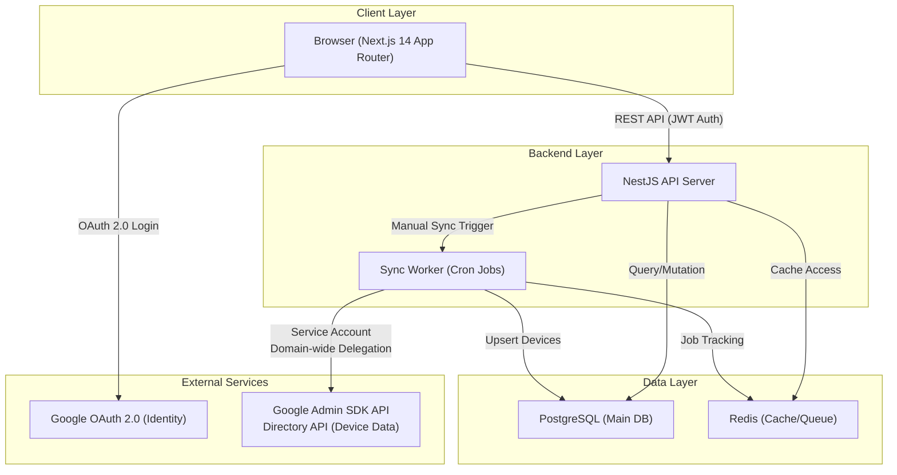
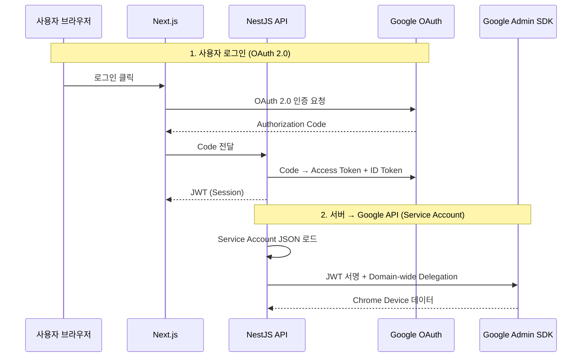
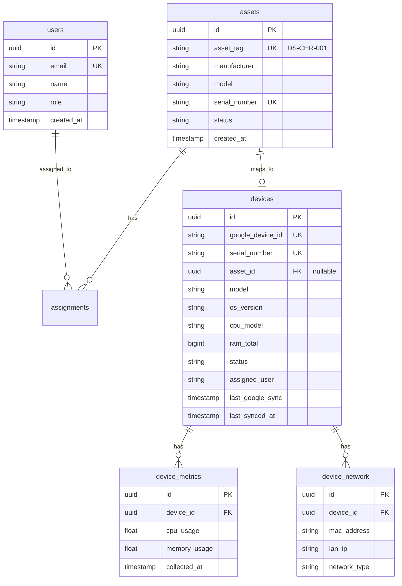
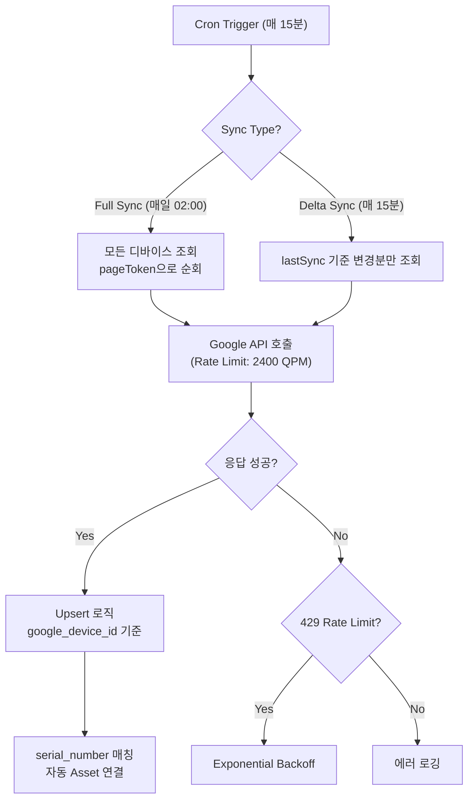

# IT Asset & Security Management System (Chrome OS Flex)

당근서비스 워크 플랫폼 내에서 Chrome OS Flex 디바이스의 IT 자산 관리와 보안 모니터링을 통합적으로 수행하기 위한 시스템입니다. Google Admin Console과 연동하여 분산된 디바이스 데이터를 통합하고, 실시간으로 사내 자산 번호(Asset Tag)와 매핑하여 자산 정합성을 확보합니다.

---

## 1. 전체 아키텍처



### 레이어 설명

| Layer | 역할 | 기술 |
| --- | --- | --- |
| **Frontend** | 대시보드, 디바이스/자산 관리 UI | Next.js 14 (App Router) + Tailwind CSS |
| **API Server** | REST API, 인증, 비즈니스 로직 | NestJS + TypeORM + PostgreSQL |
| **Sync Worker** | Google API 주기적 동기화 | NestJS (same repo) + node-cron / BullMQ |

---

## 2. Google API 연동 구조

### 2.1 인증 이중 설계



| 인증 유형 | 용도 | 방식 |
| --- | --- | --- |
| **OAuth 2.0** | 사용자 로그인 | Google Workspace 도메인 제한 |
| **Service Account** | Google Admin API 호출 | Domain-wide Delegation, `admin.directory.device.chromeos.readonly` scope |

### 2.2 Chrome Device API 호출 및 매핑

**Endpoint:**
```
GET https://admin.googleapis.com/admin/directory/v1/customer/{customerId}/devices/chromeos
```

**응답 데이터 → DB 테이블 매핑:**

| Google API 필드 | DB 컬럼 | 테이블 |
| --- | --- | --- |
| `deviceId` | `google_device_id` | devices |
| `serialNumber` | `serial_number` | devices |
| `model` | `model` | devices |
| `osVersion` | `os_version` | devices |
| `platformVersion` | `platform_version` | devices |
| `status` | `status` | devices |
| `annotatedUser` | `assigned_user` | devices |
| `annotatedAssetId` | `google_asset_id` | devices |
| `recentUsers` | relation → | device_users |
| `cpuInfo` | `cpu_model` | devices |
| `memoryInfo` | `ram_total` | devices |

---

## 3. DB ERD



---

## 4. Sync Worker 설계

### 4.1 동기화 전략



---

## 5. API 명세 (Technical Specification)

### 5.1 디바이스 API - `GET /api/devices`

**Request Query Parameters:**
- `page`: `number` (Default: 1)
- `limit`: `number` (Default: 20)
- `status`: `ACTIVE | DISABLED | DEPROVISIONED`
- `search`: `string` (Serial or Model)

**Response Body:**
```json
{
  "data": [
    {
      "id": "uuid",
      "googleDeviceId": "device_id_123",
      "serialNumber": "SN-XXXX-XXXX",
      "model": "HP Chromebook 14",
      "status": "ACTIVE",
      "osVersion": "120.0.6099.314",
      "lastGoogleSync": "2026-03-24T02:00:00Z",
      "assignedUser": "user@domain.com",
      "asset": { "id": "uuid", "assetTag": "DS-CHR-001" }
    }
  ],
  "meta": { "total": 150, "page": 1, "totalPages": 8 }
}
```

### 5.2 동기화 API - `POST /api/sync/devices` (Admin Only)

**Description:** 수동으로 Google Admin SDK와 디바이스 데이터 동기화를 트리거합니다.

---

## 6. UI & Design System

### 6.1 디자인 가이드라인

당근서비스 브랜딩 원칙에 따라 따뜻하고 직관적인 인터페이스를 제공합니다.

| 요소 | 값 | 설명 |
| --- | --- | --- |
| **Primary** | `#FF6F00` | 당근 오렌지 |
| **Secondary** | `#2E7D32` | 당근 잎 그린 |
| **Background** | `#FFF8F0` | 따뜻한 화이트 |
| **Font** | Pretendard / Inter | 가독성 중심 폰트 |

---

## 7. 프로젝트 구조 (Project Structure)

```text
it-asset-management/
├── frontend/                    # Next.js 14 App Router
│   ├── src/
│   │   ├── app/                 # Routes & Layouts
│   │   ├── components/          # Shared UI Components
│   │   ├── lib/                 # Shared Utilities
│   │   └── types/               # Type Definitions
├── backend/                     # NestJS (API & Worker)
│   ├── src/
│   │   ├── auth/                # OAuth + JWT Implementation
│   │   ├── devices/             # Device Module
│   │   ├── assets/              # Asset Module
│   │   ├── sync/                # Google Sync Logic & Worker
│   │   └── database/            # Entities & Migrations
└── docker-compose.yml           # PostgreSQL + Redis Infrastructure
```

---

## 8. MVP 개발 로드맵

- **Week 1**: 프로젝트 셋업 & Google OAuth 연동
- **Week 2**: Sync Worker 구현 & Google Admin SDK 연동
- **Week 3**: 자산-디바이스 자동 매칭 로직 개발
- **Week 4**: 대시보드 및 디바이스 관리 UI 완성

---
© 2026 IT Asset Management Team
